# 유학생기반 홈스테이 앱 기능 정의서 작성중
유학생 기반 홈스테이 앱은 유학생들이 현지 가정에서 머무르며 문화를 체험하고 학업을 지속할 수 있도록 돕는 플랫폼입니다. 이 앱은 유학생의 정보 관리, 호스트 정보 관리, 매칭 시스템, 예약 및 결제 기능 등을 포함합니다.

## 호스트 회원가입 및 로그인 사용자 스토리

### 호스트로서, 나는 개인 정보 및 홈스테이 정보를 입력하여 회원가입을 하고 싶습니다. 이를 통해, 나는 내 홈스테이를 등록하고 관리할 수 있으며, 사용자들에게 최신 정보를 제공할 수 있습니다.

#### 1. 기능명: 호스트 회원가입

- 기능 설명
  - 이 기능은 새로운 호스트가 시스템에 회원가입을 할 수 있도록 합니다. 호스트는 개인 정보 및 홈스테이 정보를 제공하여 시스템에 등록할 수 있으며, 회원가입 후에는 홈스테이 관리 및 예약 관리 기능을 사용할 수 있습니다.
- 입력 항목
  - ID: 문자열, 최대 50자
  - PW : 문자열, 최대 50자
  - 이름: 문자열, 최대 50자
  - 성별: ENUM ('남', '여')
  - 국적: 문자열, 최대 50자
  - 프로필 사진:URL 또는 파일 경로
  - 주민등록번호: 문자열, 13자 (유효성 검사 필요)
  - 언어 능력: 문자열, 최대 100자
  - 연락처: 문자열, 최대 15자 (유효성 검사 필요)
  - 이메일: 문자열, 최대 50자 (유효성 검사 필요)

##### 1.1 사용자 액션

##### 회원 가입

- 회원 가입 버튼 클릭
  - 입력 항목 유효성 검사 실행
  - 유효성 검사 오류 발생시 등록 절차는 종료되며 사용자에게 오류 정보 알림
  - 유효성 검사 통과시 가입 API 호출
  - API 호출 성공 후 요약 정보 표시
  - 가입 성공 알림 및 호스트 인증 페이지로 전환

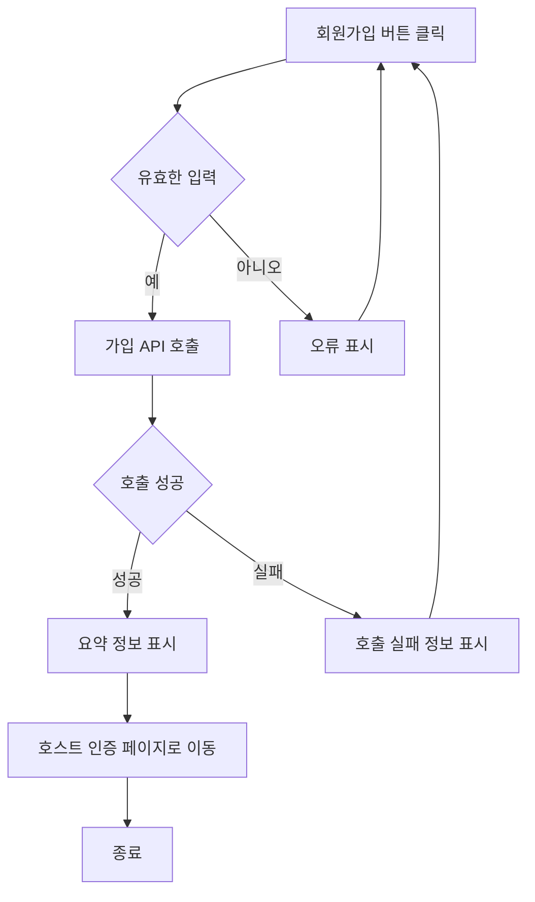

---

- 취소 버튼 클릭
  - 시작 화면으로 전환

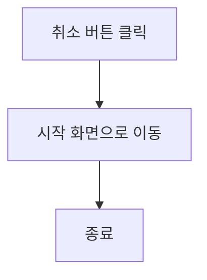

#### 2. 기능명: 호스트 인증

- 기능 설명

  - 호스트가 되고자 하는 사용자는 연계 대학교 인증 및 개인 인증 절차를 거쳐야 합니다. 이 과정을 통해 호스트의 신뢰성과 안전성을 보장하며, 사용자에게 더욱 믿을 수 있는 서비스를 제공할 수 있습니다.

- 입력 항목
  - 이름: 문자열, 최대 50자
  - 연락처: 문자열, 최대 15자 (유효성 검사 필요)
  - 이메일: 문자열, 최대 50자 (유효성 검사 필요)
  - 대학교 이름: 문자열
  - 대학교 ID: 시스템에 등록된 고유 식별자
  - 신분증: 파일 업로드 기능
  - 대학교 재학/졸업 증명서: 파일 업로드 기능

##### 2.1 사용자 액션 및 시스템 프로세스

- 인증 버튼 클릭
  - 입력 항목 유효성 검사 실행
  - 유효성 검사 오류 발생시 인증 절차는 종료되며 사용자에게 오류 정보 알림
  - 유효성 검사 통과시 인증 API 호출
  - API 호출 성공 후 요약 정보 표시
  - 인증 신청 알림 및 호스트 프로필 페이지로 전환
  - DB 비교 후 인증 결과 알림

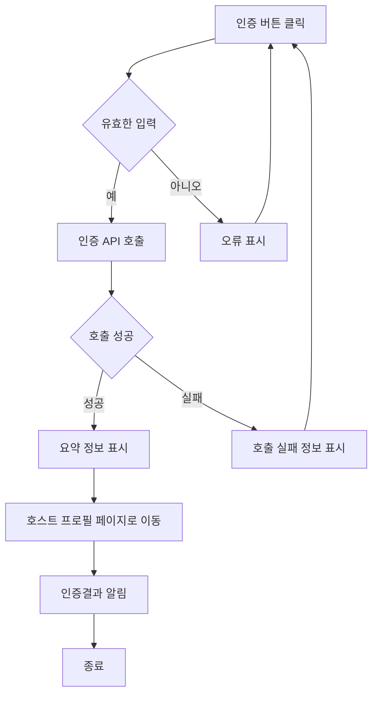

---

- 취소 버튼 클릭
  - 회원가입 진행 화면으로 전환

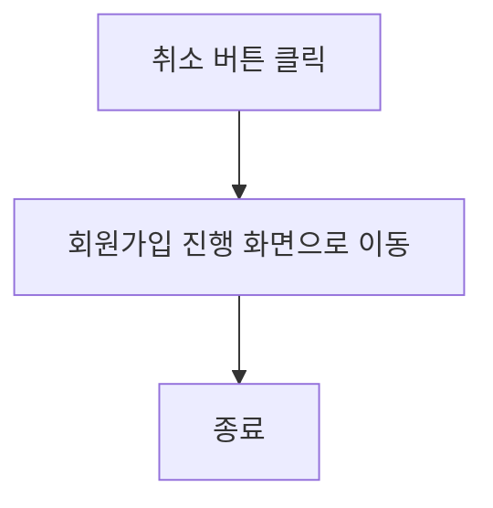

#### 3. 기능명: 호스트 로그인

- 기능 설명
  - 사용자가 기존 계정 정보를 사용하여 시스템에 접근할 수 있도록 하는 기능입니다. 로그인을 통해 사용자는 자신의 계정으로 인증받고, 개인화된 서비스를 이용할 수 있습니다.
- 입력 항목
  - ID: 문자열, 최대 50자
  - PW : 문자열, 최대 50자

##### 3.1 사용자 액션

##### 로그인

- 로그인 버튼 클릭
  - 입력 항목 유효성 검사 실행
  - 유효성 검사 오류 발생시 로그인 절차는 종료되며 사용자에게 오류 정보 알림
  - 유효성 검사 통과시 로그인 API 호출
  - API 호출 성공 후 요약 정보 표시
  - 로그인 성공 알림 및 호스트 프로필 페이지로 전환

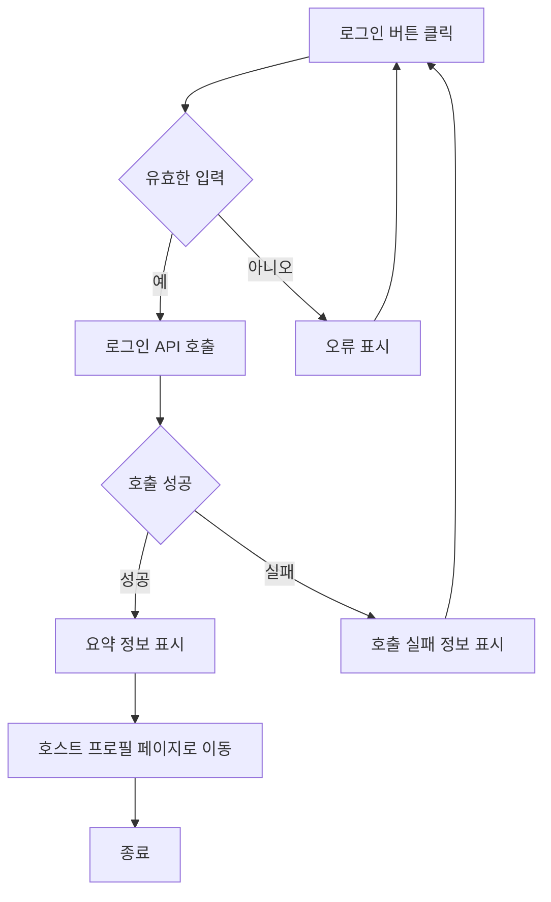

---

- 취소 버튼 클릭
  - 시작 화면으로 전환

## 호스트 숙소 등록 사용자 스토리

### 호스트로서, 나는 내 홈스테이 정보를 등록하고 싶습니다. 그래서 유학생이 내 숙소를 쉽게 찾고 예약할 수 있습니다.

#### 1. 기능명: 호스트 숙소 등록

- 기능 설명
  - 호스트는 자신의 홈스테이 정보 및 기본 정보(이름, 연락처, 주소 등)를 시스템에 등록하여 유학생 사용자에게 홈스테이 정보를 공유할 수 있다.
- 입력 항목
  - 이름: 문자열, 최대 50자 (프로필 정보 자동 완성)
  - 성별: ENUM ('남', '여') (프로필 정보 자동 제공)
  - 국적: 문자열, 최대 50자 (프로필 정보 자동 제공)
  - 프로필 사진:URL 또는 파일 경로 (프로필 정보 자동 제공)
  - 연락처: 문자열, 최대 15자 (프로필 정보 자동 제공)
  - 이메일: 문자열, 최대 50자 (프로필 정보 자동 제공)
  - 학업 정보: 문자열, 최대 100자
  - 언어 능력: 문자열, 최대 100자 (프로필 정보 자동 제공)
  - 국가: 선택형 목록 (프론트엔드에서 제공)
  - 해당 지역: 선택형 목록 (프론트엔드에서 제공)
  - 주소: 홈스테이 주소, 문자열, 최대 100자
  - 메인 이미지 업로드: 1장 업로드
  - 서브 이미지 업로드: 최대 5장 업로드
  - 홈스테이 설명: 홈스테이에 대한 설명, 문자열, 최대 500자 (여학생 전용, 옵션, 위치, 가격, 방 사이즈 등)
  - 편의 제공: 홈스테이에서 제공되는 편의 시설, 문자열, 최대 200자
  - 특별한 요구사항: 문자열, 최대 1000자
  - 등록일: 날짜 (yyyy-mm-dd 형식)
  - 입주 날짜: 날짜 (yyyy-mm-dd 형식)

##### 1.1 사용자 액션

##### 등록

- 등록 버튼 클릭
  - 입력 항목 유효성 검사 실행
  - 유효성 검사 오류 발생시 등록 절차는 종료되며 사용자에게 오류 정보 알림
  - 유효성 검사 통과시 등록 API 호출
  - API 호출 성공 후 요약 정보 표시
  - 인증 신청 알림 및 등록된 숙소 정보 페이지로 전환

---

- 취소 버튼 클릭
  - 호스트 프로필 화면으로 전환

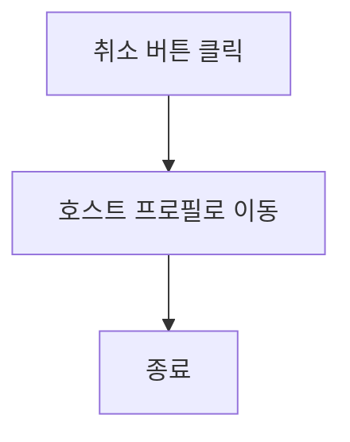

## 호스트의 개인 정보 수정 사용자 스토리

### 호스트로서, 나는 개인 정보를 수정하고 싶습니다. 그래서 최신 정보를 제공할 수 있습니다.

#### 2. 기능명: 호스트 개인 정보 수정

- 기능 설명
  - 호스트는 이 기능을 사용하여 개인 정보를 수정할 수 있습니다. 이를 통해 항상 최신의 정보를 제공할 수 있습니다.
- 입력 항목
  - ID: 문자열, 최대 50자 (유효성 검사 필요)
  - PW : 문자열, 최대 50자 (유효성 검사 필요)
  - 프로필 사진:URL 또는 파일 경로

  - 언어 능력: 문자열, 최대 100자
  - 연락처: 문자열, 최대 15자 (유효성 검사 필요)
  - 이메일: 문자열, 최대 50자 (유효성 검사 필요)

##### 2.1 사용자 액션

##### 호스트의 개인 정보 수정

- 정보 수정 버튼 클릭
  - 입력 항목 유효성 검사 실행
  - 유효성 검사 오류 발생시 등록 절차는 종료되며 사용자에게 오류 정보 알림
  - 유효성 검사 통과시 가입 API 호출
  - API 호출 성공 후 요약 정보 표시

  - 수정 성공 알림 및 내 호스트 프로필 화면으로 전환

---

- 취소 버튼 클릭
  - 내 프로필 화면으로 전환

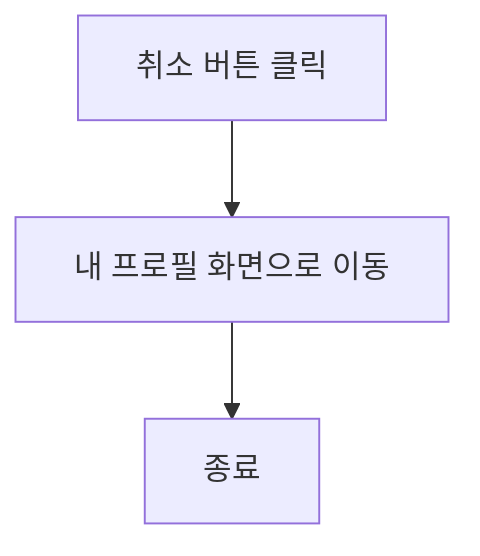

## 호스트의 홈스테이 정보 수정 사용자 스토리

### 호스트로서, 나는 기존에 등록된 홈스테이 정보를 수정하고 싶습니다. 그래서 최신 정보를 제공할 수 있습니다.

#### 2. 기능명: 호스트 홈스테이 정보 수정

- 기능 설명
  - 호스트는 이 기능을 사용하여 홈스테이 관련 정보를 수정할 수 있습니다. 이를 통해 항상 최신의 정보를 제공할 수 있으며, 홈스테이 이용자들에게 더 나은 서비스를 제공할 기회가 됩니다.
- 입력 항목
  - 국가: 선택형 목록 (최초 등록한 숙소의 주소지는 변경될 수 없음)
  - 해당 지역: 선택형 목록 (최초 등록한 숙소의 주소지는 변경될 수 없음)
  - 주소: 홈스테이 주소 (최초 등록한 숙소의 주소지는 변경될 수 없음)
  - 메인 이미지 업로드: 1장 업로드
  - 서브 이미지 업로드: 최대 5장 업로드
  - 홈스테이 설명: 홈스테이에 대한 설명, 문자열, 최대 500자 (여학생 전용, 옵션, 위치, 가격, 방 사이즈 등)
  - 편의 제공: 홈스테이에서 제공되는 편의 시설, 문자열, 최대 200자
  - 특별한 요구사항: 문자열, 최대 1000자
  - 등록일: 날짜 (yyyy-mm-dd 형식)
  - 입주 날짜: 날짜 (yyyy-mm-dd 형식)
  - 입주 날짜: 날짜 (yyyy-mm-dd 형식)
  - 최초 등록일: 날짜 (yyyy-mm-dd 형식) (변경불가)
  - 수정 등록일: 날짜 (yyyy-mm-dd 형식)

##### 1.1 사용자 액션

##### 호스트의 홈스테이 정보 수정

- 등록 버튼 클릭
  - 입력 항목 유효성 검사 실행
  - 유효성 검사 오류 발생시 등록 절차는 종료되며 사용자에게 오류 정보 알림
  - 유효성 검사 통과시 등록 API 호출
  - API 호출 성공 후 요약 정보 표시
  - 수정 성공 알림 및 내 홈스테이 목록 화면으로 전환

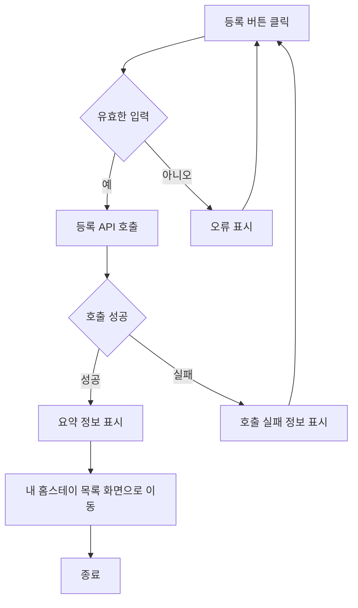

---

- 취소 버튼 클릭
  - 내 홈스테이 목록 화면으로 전환

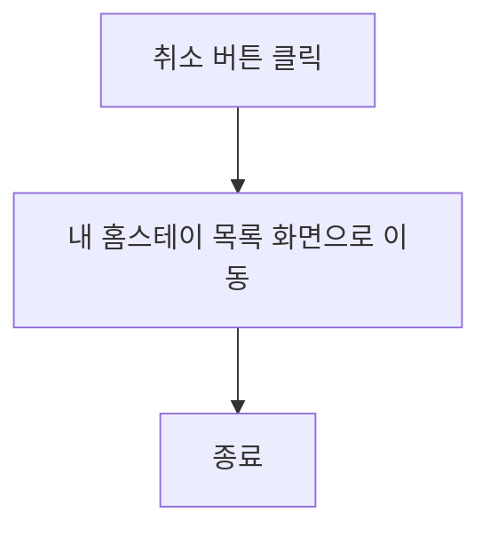

## 호스트의 홈스테이 정보 삭제 사용자 스토리

### 호스트로서, 나는 기존에 등록된 홈스테이 정보를 삭제하고 싶습니다. 그래서 최신 정보를 제공할 수 있습니다.

#### 2. 기능명: 호스트 홈스테이 정보 삭제

- 기능 설명
  - 호스트는 이 기능을 사용하여 홈스테이 정보를 삭제할 수 있습니다. 이를 통해 항상 최신의 정보를 제공할 수 있으며, 홈스테이 이용자들에게 더 나은 서비스를 제공할 기회가 됩니다.
- 입력 항목
  - ID: 문자열, 최대 50자 (유효성 검사 필요)
  - PW : 문자열, 최대 50자 (유효성 검사 필요)
  - 이름 : 문자열, 최대 50자 (유효성 검사 필요)
  - 삭제 이유: 문자열, 최대 100자

##### 2.1 사용자 액션

##### 호스트의 홈스테이 정보 삭제

- 삭제 버튼 클릭
  - 입력 항목 유효성 검사 실행
  - 유효성 검사 오류 발생시 등록 절차는 종료되며 사용자에게 오류 정보 알림
  - 유효성 검사 통과시 등록 API 호출
  - API 호출 성공 후 사용자에게 알림창 표시
  - 삭제 버튼 클릭
  - 삭제 성공 알림 및 내 홈스테이 목록 화면으로 전환

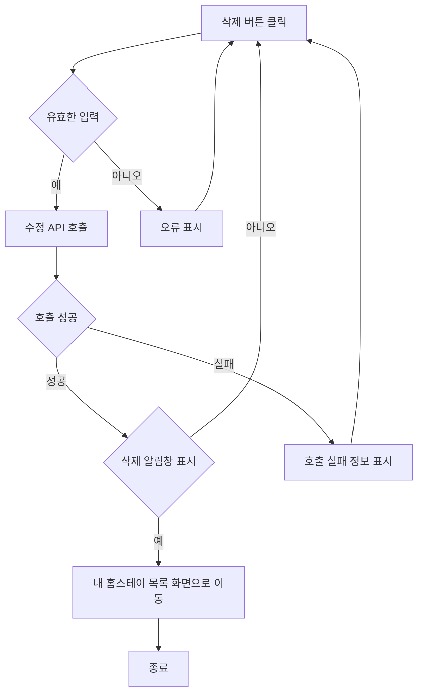

---

- 취소 버튼 클릭
  - 내 홈스테이 목록 화면으로 전환

## 유학생 홈스테이 검색기능 사용자 스토리

### 유학생으로서, 나는 나의 요구에 맞는 홈스테이를 키워드로 검색하고 싶습니다. 

#### 3.1 기능명: 키워드 검색
- 기능설명
  - 유학생은 ‘키워드’로 홈스테이 숙소를 검색 할 수 있습니다.
- 입력항목:
    - 해당 연계대학교 이름, 지역명 등 키워드 입력

##### 3.1 사용자 액션

키워드 검색

- 검색버튼 클릭
  - 입력 항목 유효성 검사 실행
  - 유효성 검사 오류 발생 시 검색 절차 종료, 사용자에게 오류정보 알림
  - 유효성 검사 통과 시 검색 API 호출
  - API 호출 성공 후 해당 데이터를 메인화면 목록 페이지에 렌더링

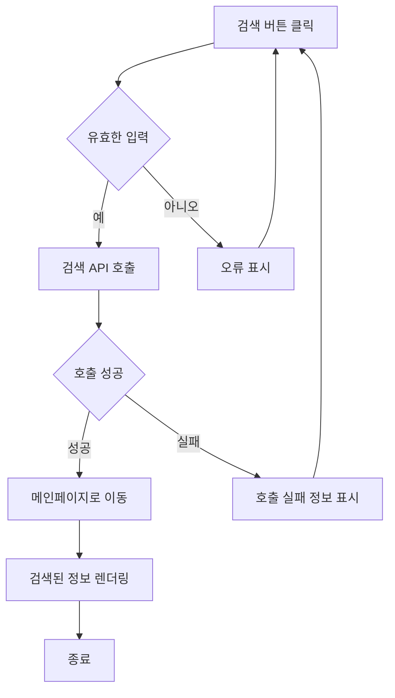
### 유학생으로서, 나는 나의 요구에 맞는 홈스테이를 조금 더 상세하게 선택하여 필터링 하고 싶습니다.

#### 3.2 기능명: 필터링 검색

-   기능설명
    -   유학생은 추가 옵션을 다중 선택하여 조금 더 세부적으로 필터링하여 숙소를 검색할 수 있습니다.
-   입력항목: 각 입력항목에 대해 다중 선택
    -   호스트 나이 대 선택
        -   30대/40대/50대/60대/70대/80대
    -   싱글 parent
        -   single Mum/single Dad
    -   Granny or Granpa House
        -   Granny/Granpa
    -   개/고양이 동거여부
        -   개와 동거/고양이와 동거
    -   흡연여부
        -   흡연/비흡연
    -   룸쉐어/독방 선호
        -   쉐어룸/독방
    -   욕실쉐어
        -   쉐어/단독사용
    -   실내/외 주차장 사용가능여부
        -   실내주차/실외주차
    -   최소거주기간
        -   단기(4-8주)/2개월/3개월/4개월/6개월/장기거주(1년이상)
    -   여성전용 여부
        -   상관없음/여성전용
    -   LGBT 친화적
        -   상관없음/예/아니오

##### 3.2 사용자 액션

다중선택에 의한 필터링 기능

다중선택(체크박스) 클릭

-   선택하지 않을 시, 필터링되지 않음
-   개별 체크박스 선택마다 검색 API호출
-   API 호출 성공 후 해당 데이터를 메인화면 목록 페이지에 렌더링

### 유학생으로서, 나는 나의 요구에 맞는 홈스테이를 조금 더 상세하게 선택하여 필터링 하고 싶습니다.

#### 3.3 기능명: 매칭 검색

-   기능설명
    -   유학생은 로그인 후 탑3 숙소 매칭 검색기능을 통해 메인화면페이지 상단에 홈스테이 숙소를 확인할 수 있습니다.
-   입력항목:
    -   ?

## 예약 및 결제 사용자 스토리

### 유학생으로서, 나는 플랫폼을 통해 숙소를 예약하고 결제하고 싶습니다. 그래서 안전하게 거래를 완료할 수 있습니다.

#### 4. 기능명: 예약 및 결제

* 기능 설명
 *  유학생이 플랫폼을 통해 숙소를 예약하고 결제할 수 있습니다. 이를 통해 안전하게 거래를 완료할 수 있으며, 호스트는 제공한 서비스에 대한 비용을 받을 수 있습니다.
* 입력 항목
 * 유학생 ID: 고유 식별자 (자동 생성)
 * 호스트 ID: 고유 식별자 (자동 생성)
 * 예약 날짜: 날짜 (yyyy-mm-dd 형식)
 * 결제 금액: 숫자, 소수점 2자리까지
 * 결제 수단: 선택형 목록 (신용카드, 페이팔 등)
 * 결제 상태: 문자열 (예: 결제 완료, 결제 대기 등)

##### 4.1 사용자 액션

##### 예약 및 결제

* 예약 및 결제 버튼 클릭
 * 입력 항목 유효성 검사 실행
 * 유효성 검사 오류 발생 시 예약 및 결제 절차는 종료되며 사용자에게 오류 정보 알림
 * 유효성 검사 통과 시 예약 및 결제 API 호출
 * API 호출 성공 후 예약 및 결제 완료 정보 표시
 * 예약 및 결제 성공 알림 및 예약 내역 페이지로 전환

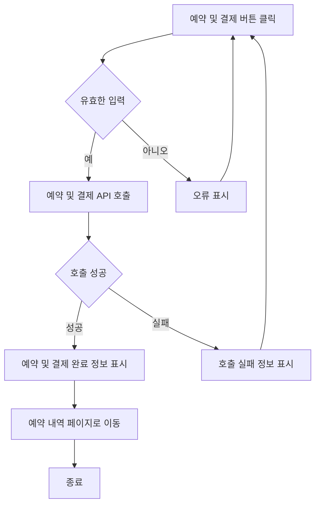

---

* 취소 버튼 클릭
  * 예약 초기화 및 이전 화면으로 전환

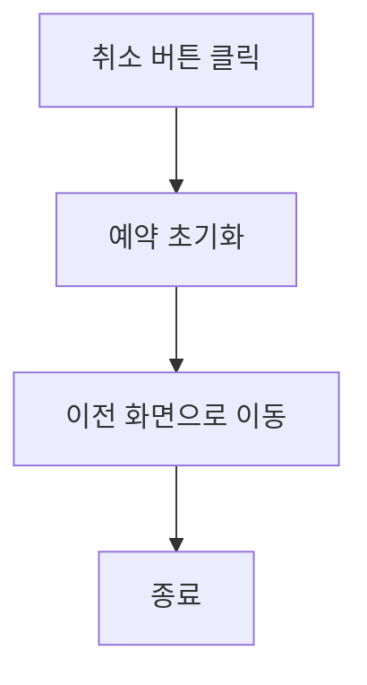

