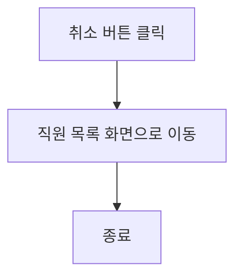

# 유학생기반 홈스테이 앱 기능 정의서

유학생 기반 홈스테이 앱은 유학생들이 현지 가정에서 머무르며 문화를 체험하고 학업을 지속할 수 있도록 돕는 플랫폼입니다. 이 앱은 유학생의 정보 관리, 호스트 정보 관리, 매칭 시스템, 예약 및 결제 기능 등을 포함합니다.

## 직원 등록 사용자 스토리

### 인사부서 직원으로서, 나는 새로운 직원을 등록하고 싶습니다. 그래서 회사의 직원 정보를 최신 상태로 유지할 수 있습니다.

#### 1. 기능명: 유학생 등록

* 기능 설명
  * 유학생은 앱에 가입 후 개인 프로필을 생성하고, 필요한 정보를 입력하여 관리할 수 있습니다.
* 입력 항목

  * ID: 고유 식별자 (자동 생성)
  * 이름: 문자열, 최대 50자
  * 성별: 
  * 국적:
  * 학업 정보: 
  * 언어 능력:
  * 특별한 요구사항: 문자열, 최대 1000자
  * 프로필 사진:
  * 주민등록번호: 문자열, 13자 (유효성 검사 필요)
  * 연락처: 문자열, 최대 15자 (유효성 검사 필요)
  * 이메일: 문자열, 최대 50자 (유효성 검사 필요)
  * 주소: 문자열, 최대 100자
  * 입주 날짜: 날짜 (yyyy-mm-dd 형식)

##### 1.1 사용자 액션

##### 등록

* 등록 버튼 클릭
  * 입력 항목 유효성 검사 실행
  * 유효성 검사 오류 발생시 등록 절차는 종료되며 사용자에게 오류 정보 알림
  * 유효성 검사 통과시 등록 API 호출
  * API 호출 성공 후 요약 정보 표시
  * 직원 목록 화면으로 전환

---

* 취소 버튼 클릭
  * 직원 목록 화면으로 전환

