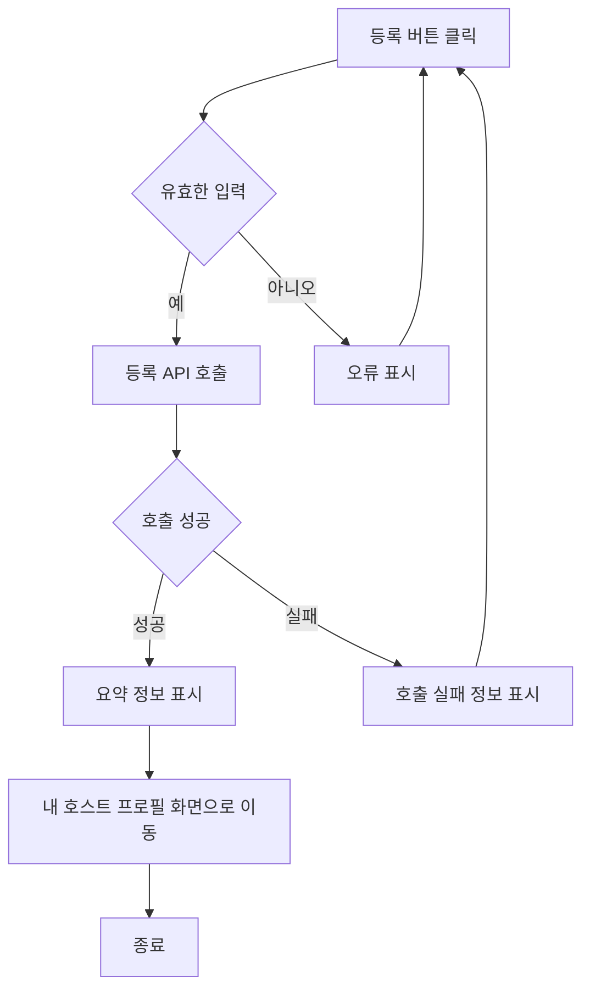
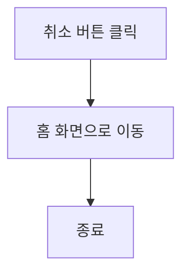

# 기능 정의서

프로젝트 정의서의 사용자 스토리를 기반으로 세부 기능을 구체적으로 정의합니다.

## 호스트 등록 사용자 스토리

### 호스트로서, 나는 내 홈스테이 정보를 등록하고 싶습니다. 그래서 유학생이 내 숙소를 쉽게 찾고 예약할 수 있습니다.

#### 1. 기능명: 호스트 등록

* 기능 설명
  * 호스트는 자신의 홈스테이 정보를 시스템에 등록하여 유학생 사용자에게 홈스테이 정보를 공유할 수 있다.
* 입력 항목
  * 호스트 ID: 고유 식별자 (자동 생성)
  * 이름: 문자열, 최대 50자
  * 주민등록번호: 문자열, 13자 (유효성 검사 필요)
  * 연락처: 문자열, 최대 15자 (유효성 검사 필요)
  * 이메일: 문자열, 최대 50자 (유효성 검사 필요)
  * 국가: 선택형 목록 (프론트엔드에서 제공)
  * 해당 지역: 선택형 목록 (프론트엔드에서 제공)
  * 메인 이미지 업로드: 1장 업로드
  * 서브 이미지 업로드: 최대 5장 업로드
  * 등록일: 날짜 (yyyy-mm-dd 형식)

##### 1.1 사용자 액션

##### 등록

* 등록 버튼 클릭
  * 입력 항목 유효성 검사 실행
  * 유효성 검사 오류 발생시 등록 절차는 종료되며 사용자에게 오류 정보 알림
  * 유효성 검사 통과시 등록 API 호출
  * API 호출 성공 후 요약 정보 표시
  * 내 호스트 프로필 화면으로 전환

---

* 취소 버튼 클릭
  * 홈 화면으로 전환

