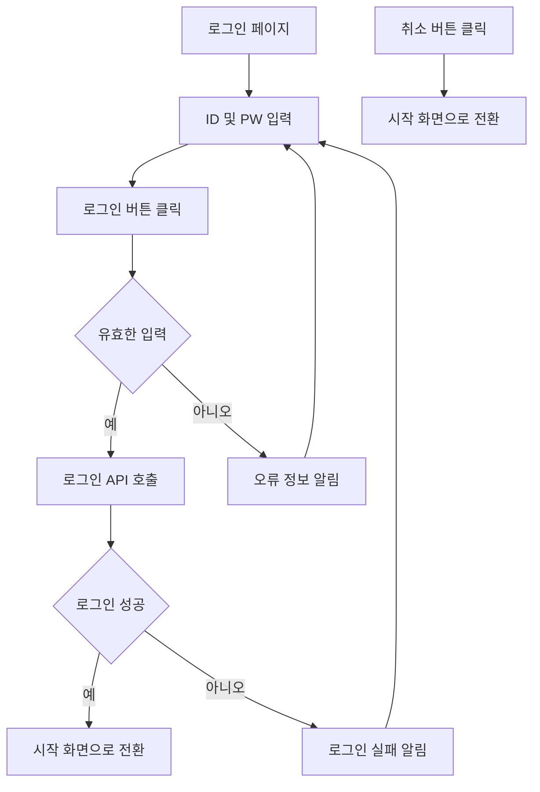
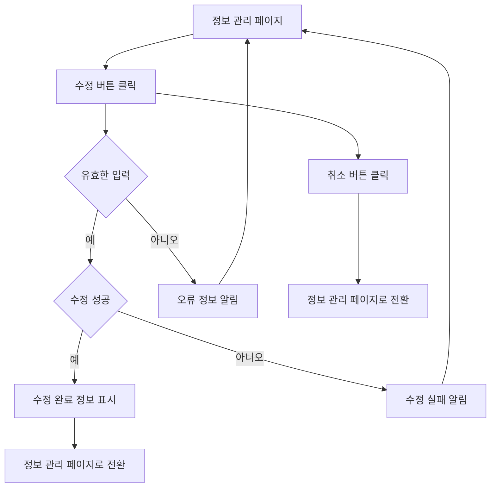
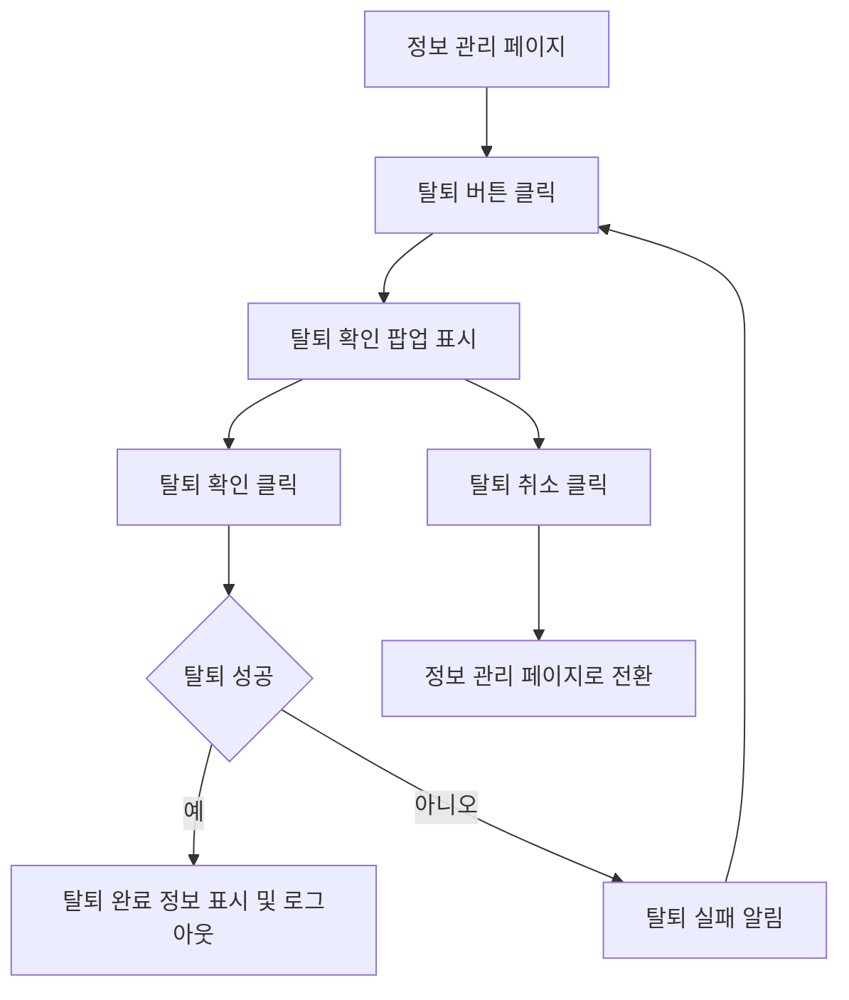
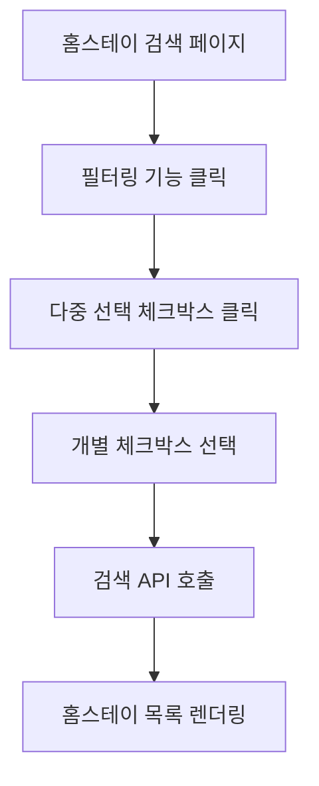
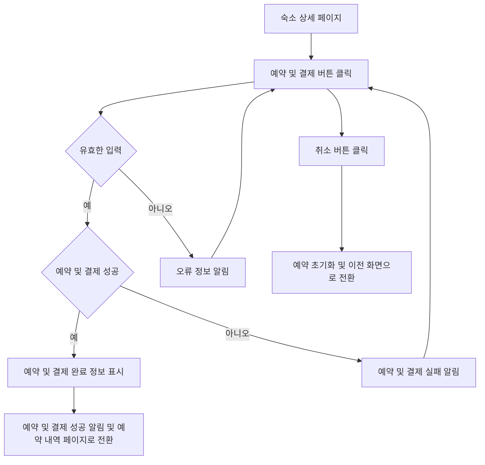

# 기능 정의서
유학생 기반 홈스테이 앱은 유학생들이 현지 가정에서 머무르며 문화를 체험하고 학업을 지속할 수 있도록 돕는 플랫폼입니다. <br>
주요 기능은 사용자 등록, 사용자 정보 관리, 숙소 등록 및 관리, 검색 기능, 예약 및 결제 시스템 등입니다.

## 1. 로그인 및 회원가입

### 서비스 유저로서, 나는 로그인 및 회원가입을 통해 서비스를 이용하고 싶습니다. 이를 통해 유학생은 최적의 홈스테이를 구하고, 호스트의 경우 임대를 통한 수익을 기대할 수 있습니다.

#### 1.1 기능명: 로그인 기능

* 기능 설명
  * 사용자가 기존 계정 정보를 사용하여 서비스에 접근할 수 있습니다.
  * 로그인을 통해 사용자는 자신의 계정으로 인증받고, 개인화된 서비스를 이용할 수 있습니다.

* 입력 항목
  * ID: 문자열, 최대 50자 (유효성 검사 필요)
  * PW : 문자열, 최대 50자 (유효성 검사 필요)
  
##### 사용자 액션

* 로그인 버튼 클릭
  * 입력 항목 입력
  * 입력 항목 유효성 검사 실행
  * 유효성 검사 오류 발생시 로그인 절차는 종료되며 사용자에게 오류 정보 알림
  * 유효성 검사 통과시 로그인 API 호출
  * API 호출 성공 후 요약 정보 표시
  * 로그인 성공 알림 및 호스트 프로필 페이지로 전환

* 취소 버튼 클릭
  * 시작 화면으로 전환



---

#### 1.2 기능명: 회원가입 기능

* 기능 설명
  * 새로운 사용자는 회원가입을 통해 서비스를 사용할 수 있습니다.
  * 회원가입 과정에서 인증 단계를 거칩니다.

* 입력 항목 [공통]
  * ID: 문자열, 최대 50자
  * PW : 문자열, 최대 50자
  * 이름: 문자열, 최대 50자
  * 성별: 선택형 목록 (남성, 여성, 기타)
  * 국적: 문자열, 최대 50자
  * 주소: 문자열, 최대 50자
  * 프로필 사진:URL 또는 파일 경로
  * 신분증: 파일 업로드 기능 (유효성 검사 필요)
  * 연락처: 문자열, 최대 15자 (유효성 검사 필요)
  * 이메일: 문자열, 최대 50자 (유효성 검사 필요)
  * 언어 능력: 문자열, 최대 100자

* 입력 항목 [유학생]
  * 국내대학교: 문자열, 최대 100자 (국내 대학 목록에서 선택)
  * 해외대학교: 문자열, 최대 100자 (국외 대학 목록에서 선택)
  * 대학교 ID: 시스템에 등록된 고유 식별자
  * 대학교 재학/졸업 증명서: 파일 업로드 기능
* 입력 항목 [호스트]
  * 연계 대학교: 문자열, 최대 100자 (국외 대학 목록에서 선택)
  * 관련 인증서: 파일 업로드 (pdf, jpg 등)
  
##### 사용자 액션

* 회원 가입 버튼 클릭
  * 유학생 및 호스트 중 선택
  * 입력 항목 입력
  * 입력 항목 유효성 검사 실행
  * 유효성 검사 오류 발생시 등록 절차는 종료되며 사용자에게 오류 정보 알림
  * 유효성 검사 통과시 가입 API 호출
  * API 호출 성공 후 요약 정보 표시
  * 가입 성공 알림 및 인증 페이지로 전환

---

* 취소 버튼 클릭
  * 로그인 및 회원가입 화면으로 전환

---

## 2. 정보 관리

### 서비스 유저로서, 나는 정보 관리를 통해 정보를 정보 변경 및 탈퇴하고 싶습니다. 이를 통해 개인 정보를 보호하고 불필요한 알림을 피할 수 있습니다.

#### 기능명: 정보 관리

* 기능 설명
  * 서비스 이용자가 자신의 개인 정보를 수정하거나 탈퇴할 수 있는 기능을 제공합니다.
  * 이를 통해 이용자는 언제든지 최신 정보를 유지하고, 원하지 않을 경우 서비스를 탈퇴할 수 있습니다.

* 입력 항목
  * 회원가입 시 입력 항목 중 수정 항목
  
##### 사용자 액션

* 수정 버튼 클릭
  * 입력 항목 유효성 검사 실행
  * 유효성 검사 오류 발생 시 수정 절차는 종료되며 사용자에게 오류 정보 알림
  * 유효성 검사 통과 시 수정 API 호출
  * API 호출 성공 후 수정 완료 정보 표시
  * 수정 성공 알림 및 현재 페이지 유지 또는 정보 확인 페이지로 전환



---
* 탈퇴 버튼 클릭
  * 탈퇴 확인 팝업 표시
  * 탈퇴 확인 시 탈퇴 API 호출
  * API 호출 성공 후 탈퇴 완료 정보 표시 및 로그아웃 처리


---

## 3. 숙소 등록 및 관리

### 호스트로서, 나는 내 홈스테이 정보를 등록하고 싶습니다. 그래서 유학생이 내 숙소를 쉽게 찾고 예약할 수 있습니다. 또 등록된 홈스테이 정보를 수정하면서 최신 정보를 제공할 수 있습니다.

##### 3.1 기능명: 홈스테이 등록

* 기능 설명
  * 호스트는 자신의 홈스테이 정보 및 기본 정보(이름, 연락처, 주소 등)를 시스템에 등록하여 유학생 사용자에게 홈스테이 정보를 공유할 수 있다.

* 입력 항목
  * 이름: 문자열, 최대 50자 (프로필 정보 자동 완성)
  * 성별: ENUM ('남', '여') (프로필 정보 자동 제공)
  * 국적: 문자열, 최대 50자 (프로필 정보 자동 제공)
  * 프로필 사진: URL 또는 파일 경로 (프로필 정보 자동 제공)
  * 연락처: 문자열, 최대 15자 (프로필 정보 자동 제공)
  * 이메일: 문자열, 최대 50자 (프로필 정보 자동 제공)
  * 학업 정보: 문자열, 최대 100자
  * 언어 능력: 문자열, 최대 100자 (프로필 정보 자동 제공)
  * 국가: 선택형 목록 (프론트엔드에서 제공)
  * 해당 지역: 선택형 목록 (프론트엔드에서 제공)
  * 주소: 홈스테이 주소, 문자열, 최대 100자
  * 메인 이미지 업로드: 1장 업로드
  * 서브 이미지 업로드: 최대 5장 업로드
  * 홈스테이 설명: 홈스테이에 대한 설명, 문자열, 최대 500자 (여학생 전용, 옵션, 위치, 가격, 방 사이즈 등)
  * 편의 제공: 홈스테이에서 제공되는 편의 시설, 문자열, 최대 200자
  * 특별한 요구사항: 문자열, 최대 1000자
  * 등록일: 날짜 (yyyy-mm-dd 형식)
  * 입주 날짜: 날짜 (yyyy-mm-dd 형식)

##### 사용자 액션

* 등록 버튼 클릭
  * 입력 항목 유효성 검사 실행
  * 유효성 검사 오류 발생 시 등록 절차는 종료되며 사용자에게 오류 정보 알림
  * 유효성 검사 통과 시 등록 API 호출
  * API 호출 성공 후 요약 정보 표시
  * 인증 신청 알림 및 등록된 숙소 정보 페이지로 전환

* 취소 버튼 클릭
  * 호스트 프로필 화면으로 전환

```mermaid
flowchart TD
    A[홈스테이 등록 페이지] --> B[입력 항목 입력]
    B --> C[등록 버튼 클릭]
    C --> D[입력 항목 유효성 검증]
    D{유효한 입력} -- 예 --> G{등록 성공}
    D -- 아니오 --> F[오류 정보 알림]
    F --> B
    G -- 예 --> H[요약 정보 표시]
    H --> I[인증 신청 알림 및 등록된 숙소 정보 페이지로 전환]
    G -- 아니오 --> J[등록 실패 알림]
    J --> B

    C --> K[취소 버튼 클릭]
    K --> L[호스트 프로필 화면으로 전환]
  ```
---

##### 3.2 기능명: 홈스테이 정보 수정 및 삭제

* 기능 설명
  * 호스트는 이 기능을 사용하여 홈스테이 관련 정보를 수정하거나 삭제할 수 있습니다. 이를 통해 항상 최신의 정보를 제공할 수 있으며, 홈스테이 이용자들에게 더 나은 서비스를 제공할 기회를 가질 수 있습니다.

* 입력 항목
  * 등록 입력 항목 중 수정 항목
  * 삭제 이유: 문자열, 최대 100자

##### 사용자 액션

* 수정 버튼 클릭
  * 입력 항목 유효성 검사 실행
  * 유효성 검사 오류 발생 시 수정 절차는 종료되며 사용자에게 오류 정보 알림
  * 유효성 검사 통과 시 수정 API 호출
  * API 호출 성공 후 요약 정보 표시
  * 수정 성공 알림 및 내 홈스테이 목록 화면으로 전환

* 삭제 버튼 클릭
  * 삭제 경고 메세지 전달
  * 삭제 이유 작성
  * 삭제 성공 알림 및 내 홈스테이 목록 화면으로 전환

* 취소 버튼 클릭
  * 내 홈스테이 목록 화면으로 전환

---

## 4. 홈스테이 검색

### 서비스 유저로서, 홈스테이를 키워드 및 필터링을 통해 검색할 수 있습니다. 이를 통해 상황에 맞는 최적의 홈스테이를 찾고 싶습니다.

#### 4.1 기능명: 키워드 검색
* 기능설명
  * 유학생은 ‘키워드’로 홈스테이 숙소를 검색 할 수 있습니다.
* 입력항목:
  * 해당 연계대학교 이름, 지역명 등 키워드 입력

##### 사용자 액션

* 검색바 클릭
  * 검색 키워드 입력 후 검색
  * 입력 항목 유효성 검사 실행
  * 유효성 검사 오류 발생 시 검색 절차 종료, 사용자에게 오류정보 알림
  * 유효성 검사 통과 시 검색 API 호출
  * API 호출 성공 후 해당 홈스테이 목록 렌더링

```mermaid
flowchart TD
    A[홈스테이 검색 페이지] --> B[검색바 클릭]
    B --> C[키워드 입력]
    C --> D[검색 버튼 클릭]
    D --> E[입력 항목 유효성 검증]
    E{유효한 입력} -- 예 --> F[검색 API 호출]
    E -- 아니오 --> G[오류 정보 알림]
    G --> B
    F --> H[홈스테이 목록 렌더링]
```
---

#### 4.2 기능명: 필터링 검색

* 기능설명
    * 유학생은 추가 옵션을 다중 선택하여 조금 더 세부적으로 필터링하여 숙소를 검색할 수 있습니다.
* 입력항목: 각 입력항목에 대해 다중 선택
    * 호스트 나이 대 선택
        * 30대/40대/50대/60대/70대/80대
    * 싱글 parent
        * single Mum/single Dad
    * Granny or Granpa House
        * Granny/Granpa
    * 개/고양이 동거여부
        * 개와 동거/고양이와 동거
    * 흡연여부
        * 흡연/비흡연
    * 룸쉐어/독방 선호
        * 쉐어룸/독방
    * 욕실쉐어
        * 쉐어/단독사용
    * 실내/외 주차장 사용가능여부
        * 실내주차/실외주차
    * 최소거주기간
        * 단기(4-8주)/2개월/3개월/4개월/6개월/장기거주(1년이상)
    * 여성전용 여부
        * 상관없음/여성전용
    * LGBT 친화적
        * 상관없음/예/아니오

##### 사용자 액션

* 필터링 기능 클릭
  * 다중선택(체크박스) 클릭
  * 선택하지 않을 시, 필터링되지 않음
  * 개별 체크박스 선택마다 검색 API호출
  * API 호출 성공 후 해당 홈스테이 목록 렌더링


---

## 5. 예약 및 결제

### 유학생으로서, 나는 플랫폼을 통해 숙소를 예약하고 결제하고 싶습니다. 그래서 안전하게 거래를 완료할 수 있습니다.

#### 기능명: 예약 및 결제

* 기능 설명
 *  유학생이 플랫폼을 통해 숙소를 예약하고 결제할 수 있습니다. 이를 통해 안전하게 거래를 완료할 수 있으며, 호스트는 제공한 서비스에 대한 비용을 받을 수 있습니다.
* 입력 항목
 * 유학생 ID: 고유 식별자 (자동 생성)
 * 호스트 ID: 고유 식별자 (자동 생성)
 * 예약 날짜: 날짜 (yyyy-mm-dd 형식)
 * 결제 금액: 숫자, 소수점 2자리까지
 * 결제 수단: 선택형 목록 (신용카드, 페이팔 등)
 * 결제 상태: 문자열 (예: 결제 완료, 결제 대기 등)

##### 사용자 액션

* 예약 및 결제 버튼 클릭
 * 입력 항목 유효성 검사 실행
 * 유효성 검사 오류 발생 시 예약 및 결제 절차는 종료되며 사용자에게 오류 정보 알림
 * 유효성 검사 통과 시 예약 및 결제 API 호출
 * API 호출 성공 후 예약 및 결제 완료 정보 표시
 * 예약 및 결제 성공 알림 및 예약 내역 페이지로 전환

* 취소 버튼 클릭
  * 예약 초기화 및 이전 화면으로 전환


