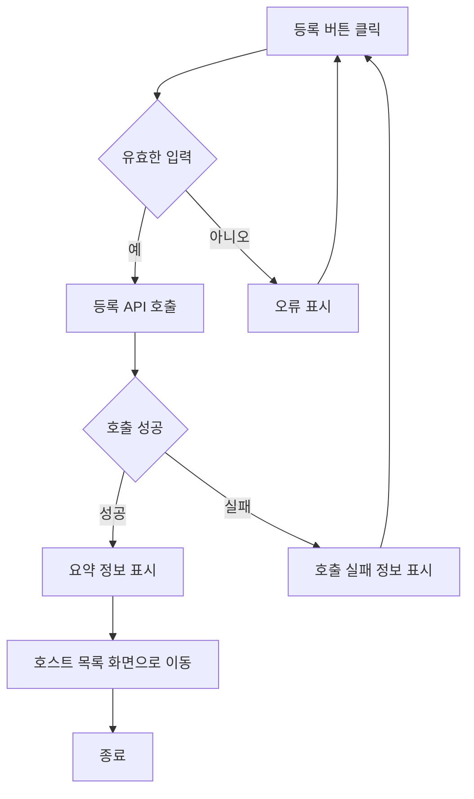
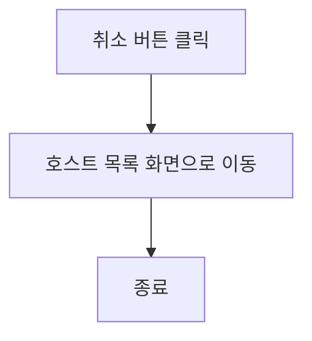

# 로그인 및 회원가입 기능정의서

유학생 기반 홈스테이 앱의 로그인 및 회원가입 기능은 사용자가 앱에 접근하여 개인화된 서비스를 이용할 수 있도록 합니다. 이 문서는 로그인과 회원가입 기능의 요구사항, 흐름, 및 세부 기능을 정의합니다.

## 요구사항

#### 1. 로그인 기능

* 기능 설명
  * 사용자는 이메일 및 비밀번호를 통해 로그인할 수 있어야 합니다.
  * 소셜 로그인(예: Google, Facebook) 기능을 제공해야 합니다.
  * 아이디와 비밀번호 찾기 설정 기능을 제공해야 합니다.
  * 비밀번호 재설정 기능을 제공해야 합니다.
 
#### 2. 회원가입 기능

  * 사용자는 필수 정보를 입력하여 계정을 생성할 수 있어야 합니다.
  * 사용자는 이름을 입력해야 합니다.
  * 사용자는 학교를 검색해야 합니다.
  * 성별: ENUM ('남', '여')
  * 이메일 인증 기능을 제공해야 합니다.
  * 사용자는 체크박스에서 희망사항을 선택해야 합니다. 
  * 소셜 회원가입(예: Google, Facebook) 기능을 제공해야 합니다.
  * 이미 등록된 사용자일시 로그인 아이디/비밀번호 찾기 설정과 연결해야 합니다.

## 세부 기능

##### 1.1 사용자 액션

##### 등록

- 등록 버튼 클릭
  - 입력 항목 유효성 검사 실행
  - 유효성 검사 오류 발생시 등록 절차는 종료되며 사용자에게 오류 정보 알림
  - 유효성 검사 통과시 등록 API 호출
  - API 호출 성공 후 요약 정보 표시
  - ****** 등록 후 보여질 페이지 *******

---

- 취소 버튼 클릭
  - 호스트 목록 화면으로 전환

## 호스트 정보 수정 사용자 스토리

### 호스트로서, 나는 개인 정보 및 홈스테이 정보를 수정하고 싶습니다. 그래서 최신 정보를 제공할 수 있습니다.

#### 2. 기능명: 호스트 정보 수정

- 기능 설명
  - 호스트는 이 기능을 사용하여 개인 정보 및 홈스테이 관련 정보를 수정할 수 있습니다. 이를 통해 항상 최신의 정보를 제공할 수 있으며, 홈스테이 이용자들에게 더 나은 서비스를 제공할 기회가 됩니다.
- 입력 항목
  - 호스트 ID: 고유 식별자 (자동 생성)
  - 이름: 문자열, 최대 50자
  - 가능 언어: 호스트가 구사할 수 있는 언어, 문자열
  - 식별번호: 문자열 (유효성 검사 필요)
  - 연락처: 문자열, 최대 15자 (유효성 검사 필요)
  - 이메일: 문자열, 최대 50자 (유효성 검사 필요)
  - 주소: 홈스테이 주소, 문자열, 최대 100자
  - 등록일: 날짜 (yyyy-mm-dd 형식)
  - 홈스테이 설명: 홈스테이에 대한 설명, 문자열, 최대 500자 (여학생 전용, 옵션, 위치, 가격, 방 사이즈 등)
  - 사진: 홈스테이의 사진, 파일 업로드 기능
  - 편의 제공: 홈스테이에서 제공되는 편의 시설, 문자열, 최대 200자

##### 2.1 사용자 액션

##### 정보 수정

- 정보 수정 버튼 클릭
  - 입력 항목 유효성 검사 실행
  - 유효성 검사 오류 발생시 등록 절차는 종료되며 사용자에게 오류 정보 알림
  - 유효성 검사 통과시 등록 API 호출
  - API 호출 성공 후 요약 정보 표시
  - 수정 성공 알림 및 현재 페이지 유지 또는 호스트 정보 페이지로 전환

---

- 취소 버튼 클릭
  - 호스트 목록 화면으로 전환

