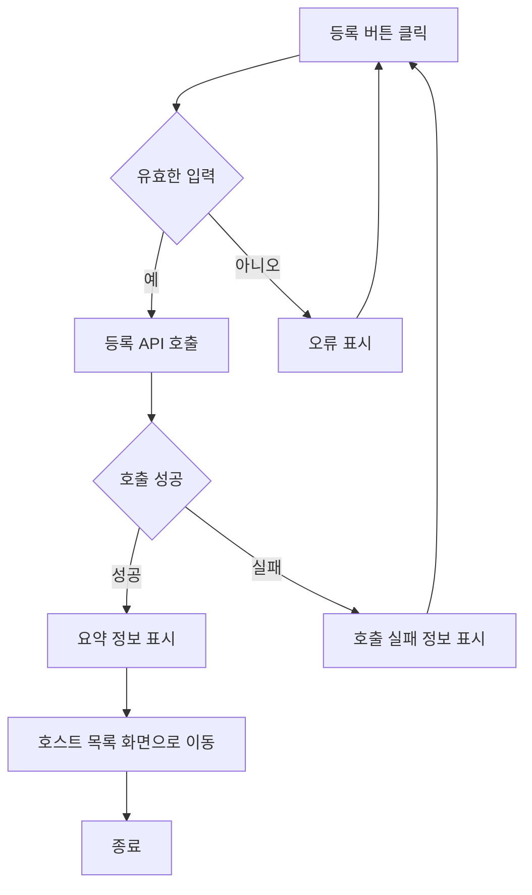
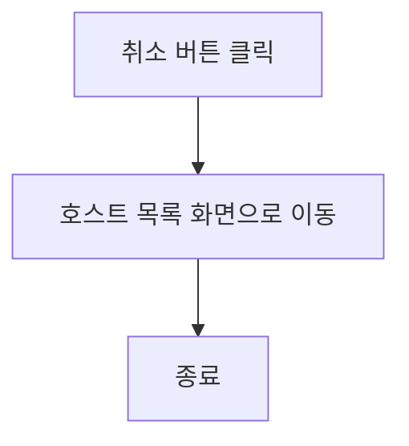

# 기능 정의서

프로젝트 정의서의 사용자 스토리를 기반으로 세부 기능을 구체적으로 정의합니다.

## 호스트 등록 사용자 스토리

### 호스트로서, 나는 내 홈스테이 정보를 등록하고 싶습니다. 그래서 유학생이 내 숙소를 쉽게 찾고 예약할 수 있습니다.

#### 1. 기능명: 호스트 등록

- 기능 설명
  - 새로운 호스트의 기본 정보(이름, 연락처, 주소 등)를 등록할 수 있습니다.
- 입력 항목
  - 호스트 ID: 고유 식별자 (자동 생성)
  - 이름: 문자열, 최대 50자
  - 식별번호: 문자열 (유효성 검사 필요)
  - 연락처: 문자열, 최대 15자 (유효성 검사 필요)
  - 이메일: 문자열, 최대 50자 (유효성 검사 필요)
  - 주소: 문자열, 최대 100자
  - 등록일: 날짜 (yyyy-mm-dd 형식)
  - 가능 언어: 호스트가 구사할 수 있는 언어, 문자열
  - 홈스테이 설명: 홈스테이에 대한 설명, 문자열, 최대 500자 (여학생 전용, 옵션, 위치, 가격, 방 사이즈 등)
  - 사진: 홈스테이의 사진, 파일 업로드 기능
  - 편의 제공: 홈스테이에서 제공되는 편의 시설, 문자열, 최대 200자

##### 1.1 사용자 액션

##### 등록

- 등록 버튼 클릭
  - 입력 항목 유효성 검사 실행
  - 유효성 검사 오류 발생시 등록 절차는 종료되며 사용자에게 오류 정보 알림
  - 유효성 검사 통과시 등록 API 호출
  - API 호출 성공 후 요약 정보 표시
  - 호스트 목록 화면으로 전환

---

- 취소 버튼 클릭
  - 호스트 목록 화면으로 전환

