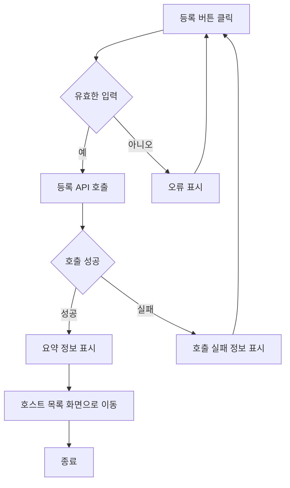
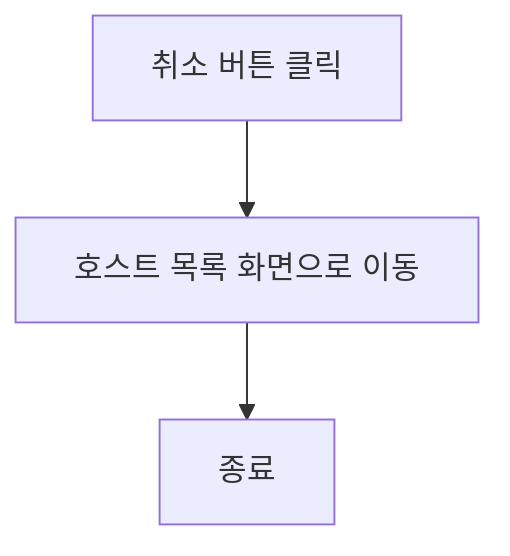

# 로그인 및 회원가입 기능정의서

유학생 기반 홈스테이 앱의 로그인 및 회원가입 기능은 사용자가 앱에 접근하여 개인화된 서비스를 이용할 수 있도록 합니다. 이 문서는 로그인과 회원가입 기능의 요구사항, 흐름, 및 세부 기능을 정의합니다.

## 요구사항

#### 1. 로그인 기능

* 로그인기능
  * 사용자는 이메일 및 비밀번호를 통해 로그인할 수 있어야 합니다.
  * 소셜 로그인(예: Google, Facebook) 기능을 제공해야 합니다.
  * 아이디와 비밀번호 찾기 설정 기능을 제공해야 합니다.
  * 비밀번호 재설정 기능을 제공해야 합니다.
 
* 회원가입 기능
  * 사용자는 필수 정보를 입력하여 계정을 생성할 수 있어야 합니다.
  * 사용자는 이름을 입력해야 합니다.
  * 사용자는 학교를 검색해야 합니다.
  * 성별: ENUM ('남', '여')
  * 이메일 인증 기능을 제공해야 합니다.
  * 사용자는 체크박스에서 희망사항을 선택해야 합니다. 
  * 소셜 회원가입(예: Google, Facebook) 기능을 제공해야 합니다.
  * 이미 등록된 사용자일시 로그인 아이디/비밀번호 찾기 설정과 연결해야 합니다.

### 세부 기능

#### 로그인기능

1. 이메일 및 비밀번호 로그인

* 입력 필드: 이메일, 비밀번호
* 유효성 검사:
  * 이메일 형식 검사 (ex. user@example.com)
  * 비밀번호 최소 8자 이상
* 오류 처리:
  * 잘못된 이메일 또는 비밀번호 시 오류 메시지 표시
  * 비활성화된 계정 시 오류 메시지 표시
* 보안:
  * 비밀번호 암호화
  * 로그인 시 세션 생성 및 관리
2. 소셜 로그인

* 지원 소셜 플랫폼: Google, Facebook
* 연동 계정 확인: 소셜 계정과 기존 앱 계정 연동 여부 확인 및 처리

3. 비밀번호 재설정
* 비밀번호 재설정 요청: 이메일 입력
* 재설정 링크 발송: 입력된 이메일로 비밀번호 재설정 링크 발송
* 새 비밀번호 설정: 재설정 링크를 통해 새로운 비밀번호 입력
  
### 회원가입기능 

1. 이메일 및 비밀번호 회원가입
 * 입력 필드:
   * 이름: 문자열, 최대 50자
   * 이메일: 문자열, 최대 50자
   * 비밀번호: 문자열, 최소 8자
   * 비밀번호 확인: 문자열, 최소 8자
 * 유효성 검사:
   * 이메일 형식 검사
   * 비밀번호와 비밀번호 확인 일치 여부 검사
 * 이메일 인증:
   * 회원가입 시 입력한 이메일로 인증 메일 발송
   * 이메일 인증 완료 후 계정 활성화
 * 신분증/비자 인증:
   * 신분증: 사진,파일 업로드
   * 비자: 사진, 파일 업로드
* 학교인증:
   * 검색기능 선택

2. 소셜 회원가입

 * 지원 소셜 플랫폼: Google, Facebook
 * 추가 정보 입력: 소셜 회원가입 후 추가 정보 입력 필요 시 안내
 * 이메일 인증:
   * 회원가입 시 입력한 이메일로 인증 메일 발송
   * 이메일 인증 완료 후 계정 활성화
 * 신분증/비자 인증:
   * 신분증: 사진,파일 업로드
   * 비자: 사진, 파일 업로드
* 학교인증:
   * 검색기능 선택
   
3. 오류 처리
 * 중복된 이메일로 회원가입 시도 시 로그인 아이디/비밀번호 찾기 연결
 * 필수 정보 누락 시 오류 메시지 표시

### 기능 흐름

#### 로그인 흐름

1. 사용자 로그인 화면 접근
2. 이메일 및 비밀번호 입력 후 로그인 버튼 클릭
 * 입력된 정보 유효성 검사
 * 유효성 검사 통과 시 서버로 로그인 요청
 * 서버에서 이메일 및 비밀번호 확인
 * 성공 시 대시보드로 이동, 실패 시 오류 메시지 표시
3. 소셜 로그인 버튼 클릭 시 해당 소셜 플랫폼의 로그인 페이지로 리다이렉트
 * 인증 후 콜백을 통해 앱으로 돌아옴
 * 성공 시 대시보드로 이동

#### 회원가입 흐름
1. 사용자 회원가입 화면 접근
2. 이메일 및 비밀번호, 이름 입력 후 회원가입 버튼 클릭
 * 입력된 정보 유효성 검사
 * 유효성 검사 통과 시 서버로 회원가입 요청
 * 서버에서 이메일 중복 여부 확인 후 성공 시 이메일 인증 메일 발송 (인증 메일에는 사용자 고유의 인증 링크 혹은 비밀번호 포함)
 * 사용자가 이메일 인증 완료 후 비자/신분증 인증 
 * 비자/신분증 인증 후 학교 선택
 * 학교측에 인증 요청
x학교측에 인증 완료 후 로그인 가능
   
3. 소셜 회원가입 버튼 클릭 시 해당 소셜 플랫폼의 회원가입 페이지로 리다이렉트
 * 인증 후 콜백을 통해 앱으로 돌아옴
 * 추가 정보 입력 필요 시 안내
  
 * 성공 시 로그인 및 대시보드로 이동

### 비자/신분증 인증

1. 사용자가 이메일에 포함된 인증 링크를 클릭하여 이메일 인증 완료
   
2. 이메일 인증 완료 후 비자/신분증 업로드 화면 이동
 * 입력 필드:
   * 비자/신분증 이미지 파일
* 유효성 검사:
   * 파일 형식 검사 (예: JPEG, PNG)
   * 파일 크기 제한 (예: 최대 5MB)
 * 오류 처리:
   * 잘못된 파일 형식 또는 크기 초과 시 오류 메시지 표시
     
3. 비자/신분증 인증 후 학교 선택
 * 비자/신분증 업로드가 성공후 사용자 학교를 선택
 * 입력 필드:
   * 학교 선택 드롭다운 메뉴
 * 유효성 검사:
   * 사용자가 학교를 선택했는지 확인
 * 오류 처리:
   * 학교를 선택하지 않은 경우 오류 메시지 표시
  
4.학교측에 인증 요청

 * 사용자 학교를 선택 후 해당 학교 인증 요청 전송
 * 학교 인증 요청 정보:
   * 사용자 이름
   * 사용자 이메일
   * 비자/신분증 이미지 파일

5. 학교측에서 인증 완료 후 로그인 가능

 * 학교 관리자가 사용자의 신분증을 확인하고 인증을 완료합니다.
 * 인증이 완료되면 사용자에게 인증 완료 알림을 발송합니다.
 * 사용자는 이제 로그인을 통해 앱에 접근할 수 있습니다.

---

- 취소 버튼 클릭
  - 호스트 목록 화면으로 전환

## 호스트 정보 수정 사용자 스토리

### 호스트로서, 나는 개인 정보 및 홈스테이 정보를 수정하고 싶습니다. 그래서 최신 정보를 제공할 수 있습니다.

#### 2. 기능명: 호스트 정보 수정

- 기능 설명
  - 호스트는 이 기능을 사용하여 개인 정보 및 홈스테이 관련 정보를 수정할 수 있습니다. 이를 통해 항상 최신의 정보를 제공할 수 있으며, 홈스테이 이용자들에게 더 나은 서비스를 제공할 기회가 됩니다.
- 입력 항목
  - 호스트 ID: 고유 식별자 (자동 생성)
  - 이름: 문자열, 최대 50자
  - 가능 언어: 호스트가 구사할 수 있는 언어, 문자열
  - 식별번호: 문자열 (유효성 검사 필요)
  - 연락처: 문자열, 최대 15자 (유효성 검사 필요)
  - 이메일: 문자열, 최대 50자 (유효성 검사 필요)
  - 주소: 홈스테이 주소, 문자열, 최대 100자
  - 등록일: 날짜 (yyyy-mm-dd 형식)
  - 홈스테이 설명: 홈스테이에 대한 설명, 문자열, 최대 500자 (여학생 전용, 옵션, 위치, 가격, 방 사이즈 등)
  - 사진: 홈스테이의 사진, 파일 업로드 기능
  - 편의 제공: 홈스테이에서 제공되는 편의 시설, 문자열, 최대 200자

##### 2.1 사용자 액션

##### 정보 수정

- 정보 수정 버튼 클릭
  - 입력 항목 유효성 검사 실행
  - 유효성 검사 오류 발생시 등록 절차는 종료되며 사용자에게 오류 정보 알림
  - 유효성 검사 통과시 등록 API 호출
  - API 호출 성공 후 요약 정보 표시
  - 수정 성공 알림 및 현재 페이지 유지 또는 호스트 정보 페이지로 전환

---

- 취소 버튼 클릭
  - 호스트 목록 화면으로 전환

