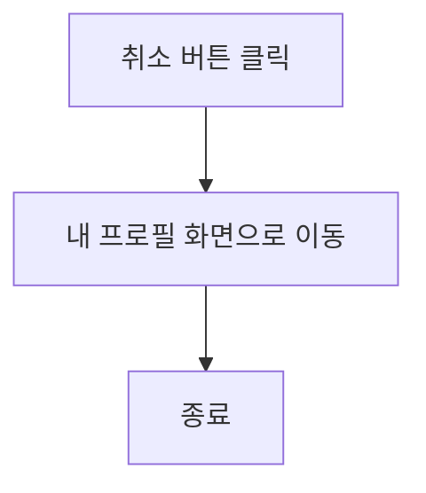
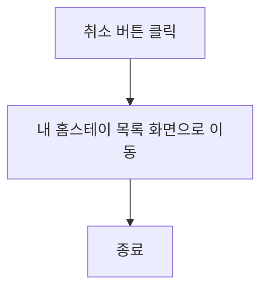
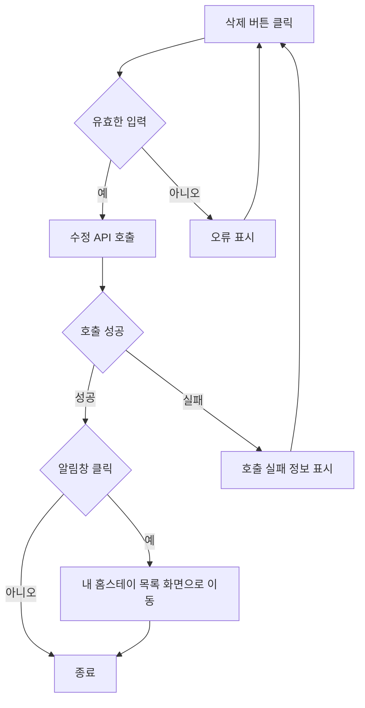

# 유학생기반 홈스테이 앱 기능 정의서 작성중

## 호스트의 개인 정보 수정 사용자 스토리

### 호스트로서, 나는 개인 정보를 수정하고 싶습니다. 그래서 최신 정보를 제공할 수 있습니다.

#### 2. 기능명: 호스트 개인 정보 수정

- 기능 설명
  - 호스트는 이 기능을 사용하여 개인 정보를 수정할 수 있습니다. 이를 통해 항상 최신의 정보를 제공할 수 있습니다.
- 입력 항목
  - ID: 문자열, 최대 50자 (유효성 검사 필요)
  - PW : 문자열, 최대 50자 (유효성 검사 필요)
  - 프로필 사진:URL 또는 파일 경로
  - 언어 능력: 문자열, 최대 100자
  - 연락처: 문자열, 최대 15자 (유효성 검사 필요)
  - 이메일: 문자열, 최대 50자 (유효성 검사 필요)

##### 2.1 사용자 액션

##### 호스트의 개인 정보 수정

- 정보 수정 버튼 클릭
  - 입력 항목 유효성 검사 실행
  - 유효성 검사 오류 발생시 등록 절차는 종료되며 사용자에게 오류 정보 알림
  - 유효성 검사 통과시 등록 API 호출
  - API 호출 성공 후 요약 정보 표시
  - 수정 성공 알림 및 내 호스트 프로필 화면으로 전환

---

- 취소 버튼 클릭
  - 내 프로필 화면으로 전환

## 호스트의 홈스테이 정보 수정 사용자 스토리

### 호스트로서, 나는 기존에 등록된 홈스테이 정보를 수정하고 싶습니다. 그래서 최신 정보를 제공할 수 있습니다.

#### 2. 기능명: 호스트 홈스테이 정보 수정

- 기능 설명
  - 호스트는 이 기능을 사용하여 홈스테이 관련 정보를 수정할 수 있습니다. 이를 통해 항상 최신의 정보를 제공할 수 있으며, 홈스테이 이용자들에게 더 나은 서비스를 제공할 기회가 됩니다.
- 입력 항목
  - 국가: 선택형 목록 (최초 등록한 숙소의 주소지는 변경될 수 없음)
  - 해당 지역: 선택형 목록 (최초 등록한 숙소의 주소지는 변경될 수 없음)
  - 주소: 홈스테이 주소 (최초 등록한 숙소의 주소지는 변경될 수 없음)
  - 메인 이미지 업로드: 1장 업로드
  - 서브 이미지 업로드: 최대 5장 업로드
  - 홈스테이 설명: 홈스테이에 대한 설명, 문자열, 최대 500자 (여학생 전용, 옵션, 위치, 가격, 방 사이즈 등)
  - 편의 제공: 홈스테이에서 제공되는 편의 시설, 문자열, 최대 200자
  - 특별한 요구사항: 문자열, 최대 1000자
  - 입주 날짜: 날짜 (yyyy-mm-dd 형식)
  - 최초 등록일: 날짜 (yyyy-mm-dd 형식) (변경불가)
  - 수정 등록일: 날짜 (yyyy-mm-dd 형식)

##### 2.1 사용자 액션

##### 호스트의 홈스테이 정보 수정

- 정보 수정 버튼 클릭
  - 입력 항목 유효성 검사 실행
  - 유효성 검사 오류 발생시 등록 절차는 종료되며 사용자에게 오류 정보 알림
  - 유효성 검사 통과시 등록 API 호출
  - API 호출 성공 후 요약 정보 표시
  - 수정 성공 알림 및 내 홈스테이 목록 화면으로 전환

---

- 취소 버튼 클릭
  - 내 홈스테이 목록 화면으로 전환

## 호스트의 홈스테이 정보 삭제 사용자 스토리

### 호스트로서, 나는 기존에 등록된 홈스테이 정보를 삭제하고 싶습니다. 그래서 최신 정보를 제공할 수 있습니다.

#### 2. 기능명: 호스트 홈스테이 정보 삭제

- 기능 설명
  - 호스트는 이 기능을 사용하여 홈스테이 정보를 삭제할 수 있습니다. 이를 통해 항상 최신의 정보를 제공할 수 있으며, 홈스테이 이용자들에게 더 나은 서비스를 제공할 기회가 됩니다.
- 입력 항목
  - ID: 문자열, 최대 50자 (유효성 검사 필요)
  - PW : 문자열, 최대 50자 (유효성 검사 필요)
  - 이름 : 문자열, 최대 50자 (유효성 검사 필요)
  - 삭제 이유: 문자열, 최대 100자

##### 2.1 사용자 액션

##### 호스트의 홈스테이 정보 삭제

- 삭제 버튼 클릭
  - 입력 항목 유효성 검사 실행
  - 유효성 검사 오류 발생시 등록 절차는 종료되며 사용자에게 오류 정보 알림
  - 유효성 검사 통과시 등록 API 호출
  - API 호출 성공 후 사용자에게 알림창 표시
  - 삭제 버튼 클릭
  - 삭제 성공 알림 및 내 홈스테이 목록 화면으로 전환

---

- 취소 버튼 클릭
  - 내 홈스테이 목록 화면으로 전환

