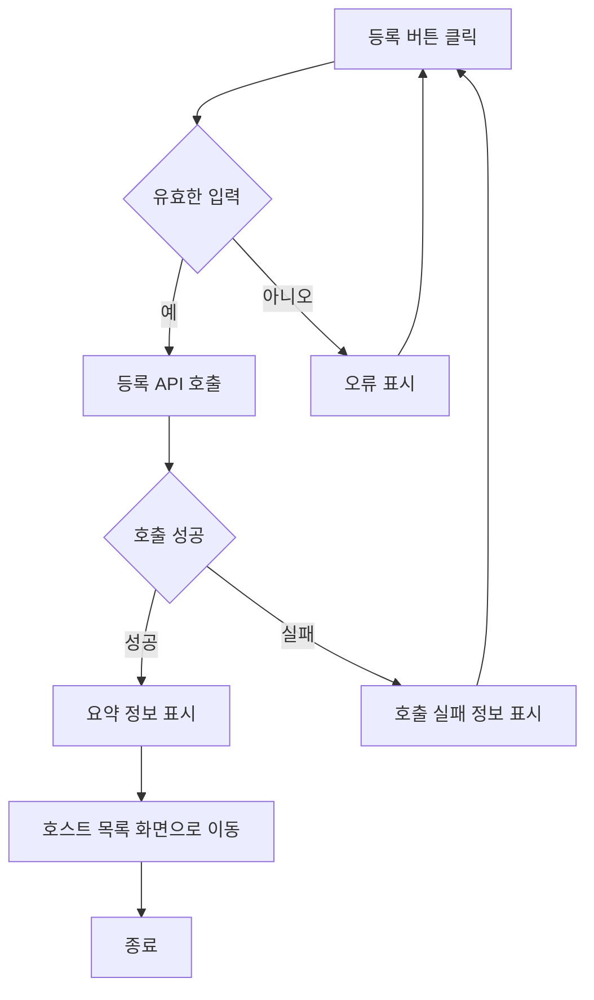
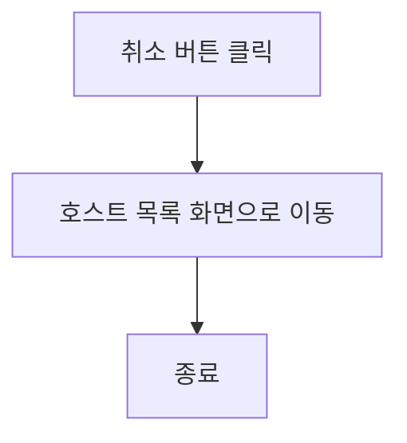
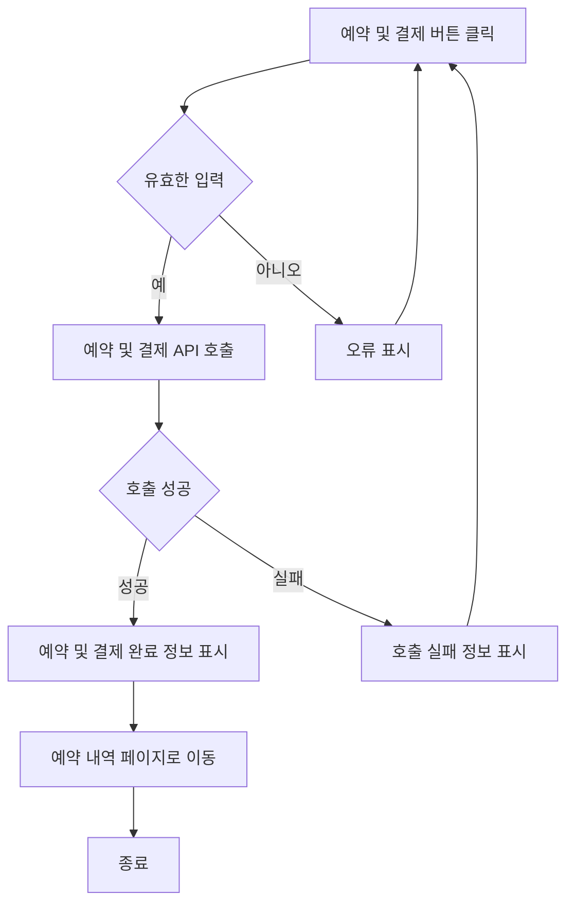
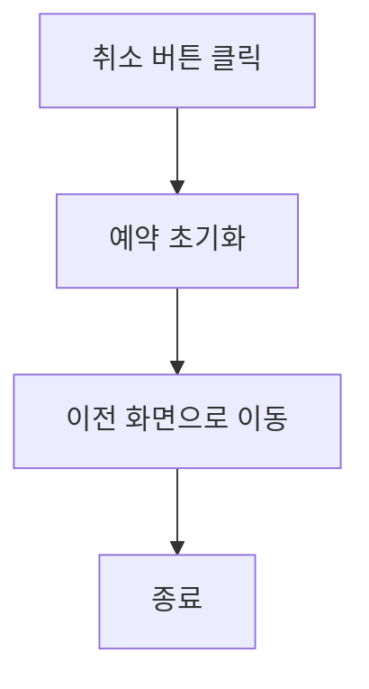

# 유학생기반 홈스테이 앱 기능 정의서 작성중

유학생 기반 홈스테이 앱은 유학생들이 현지 가정에서 머무르며 문화를 체험하고 학업을 지속할 수 있도록 돕는 플랫폼입니다. 이 앱은 유학생의 정보 관리, 호스트 정보 관리, 매칭 시스템, 예약 및 결제 기능 등을 포함합니다.

## 호스트 등록 사용자 스토리

### 호스트로서, 나는 내 홈스테이 정보를 등록하고 싶습니다. 그래서 유학생이 내 숙소를 쉽게 찾고 예약할 수 있습니다.

#### 1. 기능명: 호스트 등록

* 기능 설명
  * 호스트는 자신의 홈스테이 정보 및 기본 정보(이름, 연락처, 주소 등)를 시스템에 등록하여 유학생 사용자에게 홈스테이 정보를 공유할 수 있다.
* 입력 항목
  * 호스트 ID: 고유 식별자 (자동 생성)
  * 이름: 문자열, 최대 50자
  * 성별: ENUM ('남', '여')
  * 국적: 문자열, 최대 50자
  * 학업 정보: 문자열, 최대 100자
  * 언어 능력: 문자열, 최대 100자
  * 특별한 요구사항: 문자열, 최대 1000자
  * 프로필 사진:URL 또는 파일 경로
  * 주민등록번호: 문자열, 13자 (유효성 검사 필요)
  * 연락처: 문자열, 최대 15자 (유효성 검사 필요)
  * 이메일: 문자열, 최대 50자 (유효성 검사 필요)
  * 국가: 선택형 목록 (프론트엔드에서 제공)
  * 해당 지역: 선택형 목록 (프론트엔드에서 제공)
  * 주소: 홈스테이 주소, 문자열, 최대 100자
  * 메인 이미지 업로드: 1장 업로드
  * 서브 이미지 업로드: 최대 5장 업로드
  * 등록일: 날짜 (yyyy-mm-dd 형식)
  * 입주 날짜: 날짜 (yyyy-mm-dd 형식)
  * 홈스테이 설명: 홈스테이에 대한 설명, 문자열, 최대 500자 (여학생 전용, 옵션, 위치, 가격, 방 사이즈 등)
  * 편의 제공: 홈스테이에서 제공되는 편의 시설, 문자열, 최대 200자

##### 1.1 사용자 액션

##### 등록

- 등록 버튼 클릭
  - 입력 항목 유효성 검사 실행
  - 유효성 검사 오류 발생시 등록 절차는 종료되며 사용자에게 오류 정보 알림
  - 유효성 검사 통과시 등록 API 호출
  - API 호출 성공 후 요약 정보 표시
  - ****** 등록 후 보여질 페이지 *******

---

- 취소 버튼 클릭
  - 호스트 목록 화면으로 전환

## 호스트 정보 수정 사용자 스토리

### 호스트로서, 나는 개인 정보 및 홈스테이 정보를 수정하고 싶습니다. 그래서 최신 정보를 제공할 수 있습니다.

#### 2. 기능명: 호스트 정보 수정

- 기능 설명
  - 호스트는 이 기능을 사용하여 개인 정보 및 홈스테이 관련 정보를 수정할 수 있습니다. 이를 통해 항상 최신의 정보를 제공할 수 있으며, 홈스테이 이용자들에게 더 나은 서비스를 제공할 기회가 됩니다.
- 입력 항목
  - 호스트 ID: 고유 식별자 (자동 생성)
  - 이름: 문자열, 최대 50자
  - 가능 언어: 호스트가 구사할 수 있는 언어, 문자열
  - 식별번호: 문자열 (유효성 검사 필요)
  - 연락처: 문자열, 최대 15자 (유효성 검사 필요)
  - 이메일: 문자열, 최대 50자 (유효성 검사 필요)
  - 주소: 홈스테이 주소, 문자열, 최대 100자
  - 등록일: 날짜 (yyyy-mm-dd 형식)
  - 홈스테이 설명: 홈스테이에 대한 설명, 문자열, 최대 500자 (여학생 전용, 옵션, 위치, 가격, 방 사이즈 등)
  - 사진: 홈스테이의 사진, 파일 업로드 기능
  - 편의 제공: 홈스테이에서 제공되는 편의 시설, 문자열, 최대 200자

##### 2.1 사용자 액션

##### 정보 수정

- 정보 수정 버튼 클릭
  - 입력 항목 유효성 검사 실행
  - 유효성 검사 오류 발생시 등록 절차는 종료되며 사용자에게 오류 정보 알림
  - 유효성 검사 통과시 등록 API 호출
  - API 호출 성공 후 요약 정보 표시
  - 수정 성공 알림 및 현재 페이지 유지 또는 호스트 정보 페이지로 전환

---

- 취소 버튼 클릭
  - 호스트 목록 화면으로 전환

## 예약 및 결제 사용자 스토리

### 유학생으로서, 나는 플랫폼을 통해 숙소를 예약하고 결제하고 싶습니다. 그래서 안전하게 거래를 완료할 수 있습니다.

#### 4. 기능명: 예약 및 결제

* 기능 설명
 *  유학생이 플랫폼을 통해 숙소를 예약하고 결제할 수 있습니다. 이를 통해 안전하게 거래를 완료할 수 있으며, 호스트는 제공한 서비스에 대한 비용을 받을 수 있습니다.
* 입력 항목
 * 유학생 ID: 고유 식별자 (자동 생성)
 * 호스트 ID: 고유 식별자 (자동 생성)
 * 예약 날짜: 날짜 (yyyy-mm-dd 형식)
 * 결제 금액: 숫자, 소수점 2자리까지
 * 결제 수단: 선택형 목록 (신용카드, 페이팔 등)
 * 결제 상태: 문자열 (예: 결제 완료, 결제 대기 등)

##### 4.1 사용자 액션

##### 예약 및 결제

* 예약 및 결제 버튼 클릭
 * 입력 항목 유효성 검사 실행
 * 유효성 검사 오류 발생 시 예약 및 결제 절차는 종료되며 사용자에게 오류 정보 알림
 * 유효성 검사 통과 시 예약 및 결제 API 호출
 * API 호출 성공 후 예약 및 결제 완료 정보 표시
 * 예약 및 결제 성공 알림 및 예약 내역 페이지로 전환

---

* 취소 버튼 클릭
  * 예약 초기화 및 이전 화면으로 전환

