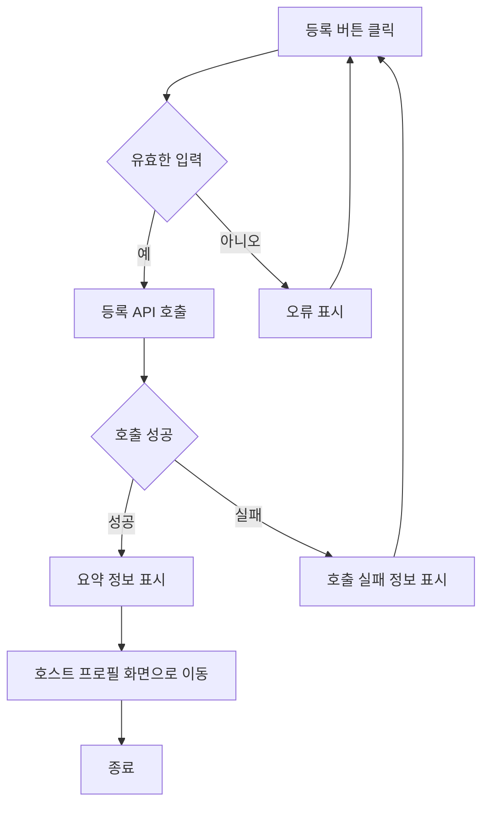

# 유학생기반 홈스테이 앱 기능 정의서 작성중

유학생 기반 홈스테이 앱은 유학생들이 현지 가정에서 머무르며 문화를 체험하고 학업을 지속할 수 있도록 돕는 플랫폼입니다. 이 앱은 유학생의 정보 관리, 호스트 정보 관리, 매칭 시스템, 예약 및 결제 기능 등을 포함합니다.

## 호스트 회원가입 사용자 스토리

### 호스트로서, 나는 개인 정보 및 홈스테이 정보를 입력하여 회원가입을 하고 싶습니다. 이를 통해, 나는 내 홈스테이를 등록하고 관리할 수 있으며, 사용자들에게 최신 정보를 제공할 수 있습니다.

#### 1. 기능명: 호스트 회원가입

- 기능 설명
  - 이 기능은 새로운 호스트가 시스템에 회원가입을 할 수 있도록 합니다. 호스트는 개인 정보 및 홈스테이 정보를 제공하여 시스템에 등록할 수 있으며, 등록 후에는 홈스테이 관리 및 예약 관리 기능을 사용할 수 있습니다.
- 입력 항목
  - ID: 문자열, 최대 50자
  - PW : 문자열, 최대 50자
  - 이름: 문자열, 최대 50자
  - 성별: ENUM ('남', '여')
  - 국적: 문자열, 최대 50자
  - 프로필 사진:URL 또는 파일 경로
  - 주민등록번호: 문자열, 13자 (유효성 검사 필요)
  - 언어 능력: 문자열, 최대 100자
  - 연락처: 문자열, 최대 15자 (유효성 검사 필요)
  - 이메일: 문자열, 최대 50자 (유효성 검사 필요)

##### 1.1 사용자 액션

##### 회원 가입

- 회원 가입 버튼 클릭
  - 입력 항목 유효성 검사 실행
  - 유효성 검사 오류 발생시 등록 절차는 종료되며 사용자에게 오류 정보 알림
  - 유효성 검사 통과시 등록 API 호출
  - API 호출 성공 후 요약 정보 표시
  - 가입 성공 알림 및 호스트 프로필 페이지로 전환

## 호스트 숙소 등록 사용자 스토리

### 호스트로서, 나는 내 홈스테이 정보를 등록하고 싶습니다. 그래서 유학생이 내 숙소를 쉽게 찾고 예약할 수 있습니다.

#### 2. 기능명: 호스트 숙소 등록

- 기능 설명
  - 호스트는 자신의 홈스테이 정보 및 기본 정보(이름, 연락처, 주소 등)를 시스템에 등록하여 유학생 사용자에게 홈스테이 정보를 공유할 수 있다.
- 입력 항목
  - 이름: 문자열, 최대 50자 (프로필 정보 자동 완성)
  - 성별: ENUM ('남', '여') (프로필 정보 자동 제공)
  - 국적: 문자열, 최대 50자 (프로필 정보 자동 제공)
  - 프로필 사진:URL 또는 파일 경로 (프로필 정보 자동 제공)
  - 연락처: 문자열, 최대 15자 (프로필 정보 자동 제공)
  - 이메일: 문자열, 최대 50자 (프로필 정보 자동 제공)
  - 학업 정보: 문자열, 최대 100자
  - 언어 능력: 문자열, 최대 100자 (프로필 정보 자동 제공)
  - 국가: 선택형 목록 (프론트엔드에서 제공)
  - 해당 지역: 선택형 목록 (프론트엔드에서 제공)
  - 주소: 홈스테이 주소, 문자열, 최대 100자
  - 메인 이미지 업로드: 1장 업로드
  - 서브 이미지 업로드: 최대 5장 업로드
  - 홈스테이 설명: 홈스테이에 대한 설명, 문자열, 최대 500자 (여학생 전용, 옵션, 위치, 가격, 방 사이즈 등)
  - 편의 제공: 홈스테이에서 제공되는 편의 시설, 문자열, 최대 200자
  - 특별한 요구사항: 문자열, 최대 1000자
  - 등록일: 날짜 (yyyy-mm-dd 형식)
  - 입주 날짜: 날짜 (yyyy-mm-dd 형식)

##### 2.1 사용자 액션

##### 등록

- 등록 버튼 클릭
  - 입력 항목 유효성 검사 실행
  - 유효성 검사 오류 발생시 등록 절차는 종료되며 사용자에게 오류 정보 알림
  - 유효성 검사 통과시 등록 API 호출
  - API 호출 성공 후 요약 정보 표시
  - **\*\*** 등록 후 보여질 페이지 **\*\*\***

---

- 취소 버튼 클릭
  - 호스트 목록 화면으로 전환

